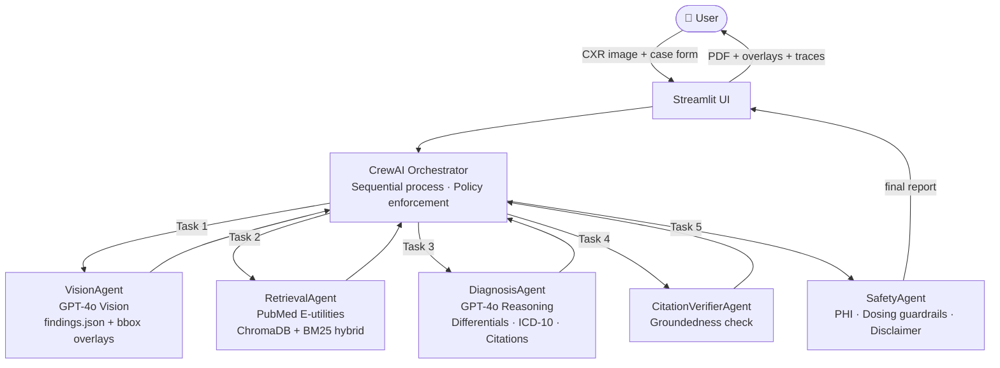

# 🏥 MedAI — Agentic Diagnostic Decision Support

> **RESEARCH & EDUCATION ONLY — NOT A MEDICAL DEVICE — NOT FOR CLINICAL USE**

A multi-agent web portal that analyzes chest X-rays + clinical vignettes to produce evidence-grounded diagnostic decision support reports. Built with **CrewAI** orchestration, **GPT-4o Vision**, and **PubMed RAG**.

---

## Architecture



### Agent Team

| Agent | Framework Role | Responsibility | Model/Tool |
|-------|---------------|---------------|-----------|
| **OrchestratorAgent** | CrewAI Crew | Plans pipeline, routes tasks, enforces policy, retries | CrewAI Process.sequential |
| **VisionAgent** | CrewAI Agent + Tool | CXR analysis → `findings.json` + bbox overlays | GPT-4o Vision |
| **RetrievalAgent** | CrewAI Agent + Tool | Hybrid BM25+vector search; PubMed E-utilities | ChromaDB + text-embedding-3-small |
| **DiagnosisAgent** | CrewAI Agent + Tool | Differentials, ICD-10, red flags, next steps, inline citations | GPT-4o |
| **CitationVerifierAgent** | CrewAI Agent + Tool | Validates every claim has an exact verbatim quote | Rule-based |
| **SafetyAgent** | CrewAI Agent + Tool | PHI check, dosing guardrails, disclaimers | Rule-based |

### Orchestration Design

CrewAI is used as the orchestration framework (`Process.sequential`) with each agent implemented as a `crewai.Agent` with a dedicated `BaseTool` wrapping the underlying agent class. Tasks have explicit `context` dependencies enforcing the Vision → Retrieval → Diagnosis → Verification → Safety order.

A direct pipeline fallback (`agents/pipeline.py`) activates automatically if CrewAI returns an empty report, ensuring the app never fails silently.

---

## Project Structure

```
medai/
├── app.py                          # Streamlit UI (3 tabs: Input, Results, Traces)
├── agents/
│   ├── crew.py                     # CrewAI orchestration — Agents, Tasks, Tools
│   ├── pipeline.py                 # Direct pipeline (fallback + reference implementation)
│   ├── vision_agent.py             # GPT-4o Vision CXR analysis
│   ├── retrieval_agent.py          # PubMed E-utilities + ChromaDB + BM25 hybrid RAG
│   ├── diagnosis_agent.py          # GPT-4o clinical reasoning + report generation
│   ├── verifier_agent.py           # Citation groundedness verification
│   └── safety_agent.py             # PHI / dosing guardrails / disclaimer
├── api/
│   └── main.py                     # FastAPI POST /analyze-case endpoint
├── rag/
│   ├── seed_index.py               # Pre-populate ChromaDB from PubMed (~200 abstracts)
│   └── chroma_store/               # Persisted vector index (git-ignored, rebuilt via seed)
├── utils/
│   ├── overlay.py                  # Bounding box drawing on PIL images
│   └── pdf_export.py               # ReportLab PDF generation
├── sample_data/
│   └── traces/
│       ├── sample_traces.jsonl         # Pre-built sample agent traces
│       ├── trace_dyspnea_case.jsonl    # Real trace: acute dyspnea case
│       └── trace_crewai_run.jsonl      # Real trace: CrewAI orchestration run
├── openapi.yaml                    # OpenAPI 3.1 spec for /analyze-case
├── Dockerfile
├── docker-compose.yml              # Streamlit (8501) + FastAPI (8000)
├── requirements.txt
├── .env.template
└── .gitignore
```

---

## Quick Start

### 1. Clone & configure

```bash
git clone https://github.com/daanyal-23/medai-agentic-dds.git
cd medai
cp .env.template .env
# Edit .env — add your OPENAI_API_KEY
```

### 2. Create virtual environment & install

```bash
python -m venv venv
source venv/bin/activate        # Mac/Linux
# venv\Scripts\activate         # Windows

pip install -r requirements.txt
```

### 3. Seed the RAG index

```bash
python rag/seed_index.py
```

Pre-populates ChromaDB with ~200 PubMed abstracts covering pneumothorax, PE, CHF, ACS, ARDS, pneumonia, and more. Takes ~3 minutes. Only needs to be run once.

### 4. Launch Streamlit

```bash
streamlit run app.py
```

Open `http://localhost:8501`

### 5. (Optional) Launch FastAPI

```bash
uvicorn api.main:app --reload --port 8000
# Swagger UI: http://localhost:8000/docs
```

---

## Docker

```bash
docker-compose up --build
```

Starts both Streamlit (port 8501) and FastAPI (port 8000) with shared volumes for ChromaDB and traces.

---

## RAG Pipeline

1. **PubMed E-utilities** (ESearch → EFetch) fetches abstracts by clinical query at runtime
2. Abstracts truncated to 4000 chars and upserted into **ChromaDB** with OpenAI `text-embedding-3-small`
3. **BM25** re-ranks vector candidates (hybrid: 70% vector / 30% BM25)
4. Top-k snippets passed to DiagnosisAgent with PMID, DOI, year, study type, and verbatim quote

---

## API Contract

### `POST /analyze-case`

**Request:**
```json
{
  "case_id": "abc-123",
  "patient_context": {
    "age": 64, "sex": "Male",
    "chief_complaint": "Acute dyspnea",
    "vitals": {"BP": "98/60", "HR": 120, "RR": 28, "SpO2": 88},
    "labs": {"D_dimer": 1200, "troponin": 0.03, "WBC": 9.2, "CRP": 12.0},
    "meds": ["metformin 500mg BD"]
  },
  "image_b64": "<base64-encoded PNG/JPEG>",
  "preferences": {"recency_years": 5, "max_citations": 10}
}
```

**Response:**
```json
{
  "case_id": "abc-123",
  "imaging_findings": {
    "cardiomegaly": {"prob": 0.70, "laterality": "central", "size": "moderate"}
  },
  "differentials": [
    {
      "dx": "Pulmonary Embolism", "icd10": "I26.99",
      "rationale": "Acute dyspnea + elevated D-dimer + tachycardia...",
      "support": [{"snippet_id": "s1"}]
    }
  ],
  "red_flags": ["Pulmonary embolism", "Acute heart failure"],
  "next_steps": ["CT pulmonary angiography", "Echocardiogram"],
  "citations": [
    {
      "id": "s1", "pmid": "28925655", "doi": "10.1001/jama.2019.1234",
      "title": "Pleuritic Chest Pain: Sorting Through the Differential Diagnosis",
      "year": "2017", "study_type": "Observational Study",
      "quote": "Myocardial infarction, pericarditis, aortic dissection..."
    }
  ],
  "overlays": [{"overlay_id": "ovl_001", "type": "bbox", "coords": [0.3, 0.2, 0.4, 0.5], "label": "Cardiomegaly"}],
  "groundedness_note": "All 4 citations verified against 10 retrieved snippets. ✓",
  "disclaimer": "RESEARCH & EDUCATION ONLY. Not a medical device."
}
```

Full spec: [`openapi.yaml`](./openapi.yaml)

---

## Observability

Every pipeline run emits a JSONL trace with per-agent timing, input payloads, and output previews:

```jsonl
{"agent": "OrchestratorAgent", "action": "plan_and_route", "plan": [...], "duration_ms": 24393, "status": "success"}
{"agent": "VisionAgent", "action": "analyze_cxr", "input_summary": "Image size: (512, 512)", "duration_ms": 2969, "status": "success"}
{"agent": "RetrievalAgent", "action": "hybrid_search", "output_preview": "10 snippets retrieved", "duration_ms": 5042, "status": "success"}
{"agent": "DiagnosisAgent", "action": "generate_report", "output_preview": "4 differentials", "duration_ms": 16381, "status": "success"}
{"agent": "CitationVerifierAgent", "action": "verify_citations", "output_preview": "All 4 citations verified ✓", "duration_ms": 0.1, "status": "success"}
{"agent": "SafetyAgent", "action": "compliance_check", "duration_ms": 0.6, "status": "success"}
```

Sample traces for 3 real sessions are in `sample_data/traces/`.

---

## Non-Functional Requirements

| Requirement | Implementation |
|-------------|---------------|
| **Orchestration** | CrewAI `Process.sequential` with direct pipeline fallback |
| **Local dev** | Docker + docker-compose (Streamlit 8501, FastAPI 8000) |
| **Observability** | Per-agent JSONL traces with timing, inputs, outputs, RAG stats |
| **Security** | No secrets in repo; `.env.template`; TLS via Streamlit Cloud |
| **Compliance** | "Not a medical device" banner; no PHI stored/transmitted; dosing guardrails |
| **Resilience** | VisionAgent retries ×3; CrewAI retries ×2; automatic fallback to direct pipeline |

---

## Data Sources

- **Test images**: NIH ChestX-ray14, CheXpert, VinDr-CXR (public datasets)
- **Literature**: PubMed/PMC via E-utilities; preprints labeled as such
- **Synthetic patients**: No real patient data — all vignettes are synthetic
- **No PHI**: System processes de-identified images only; no data stored

---

## Known Limitations

- VisionAgent occasionally returns empty findings on first cold-start run — automatic retry and pipeline fallback handles this
- Citation quality depends on ChromaDB index coverage — run `seed_index.py` before use
- GPT-4o is non-deterministic at temperature 0.2 — repeated runs on the same case may produce slightly different differentials (realistic clinical behavior)

---

## Disclaimer

This system is for **research and educational purposes only**. It is **not** a medical device, is **not** FDA/CE cleared, and must **not** be used for clinical decision making. All outputs require review by a qualified clinician before any action is taken.